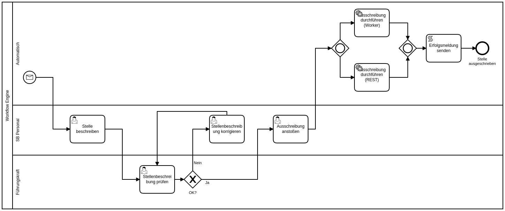

# Camunda BPMN - WS2018



## Deploy with docker-compose

Start the engine with docker-compose:

```bash
docker-compose up
```

To reach the webinterfaces go to:  
<http://localhost:8090/camunda>

Login credentials:
| Username | Password | Used in example          |
|----------|----------|--------------------------|
| demo     | demo     | :heavy_check_mark: Admin |
| mary     | mary     | :heavy_check_mark: HR    |
| john     | john     | :heavy_check_mark: Leader|
| peter    | peter    | :heavy_multiplication_x: |

To deploy the BPMN Process:

```bash
./deploy.sh
```

## Start process instances via REST API

```bash
./start_process.sh
```

## Develop with Camunda Modler

Download the platformspecific camunda modler:  
<https://camunda.com/download/modeler/>

Open the bpmn files and start working :P.
